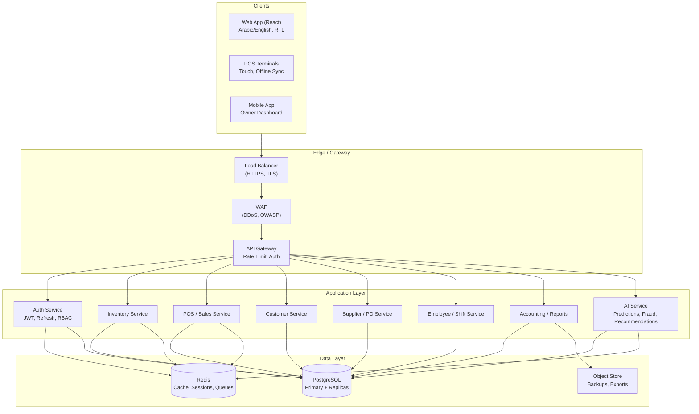

# Egypt Supermarket Management System — System Architecture

## 1. Design Principles

- **Security first:** Authentication, authorization, encryption, and audit at every layer.
- **Scalability:** Stateless API, Redis cache, DB read replicas, queue for heavy jobs.
- **Resilience:** Offline-capable POS with sync, backups, and clear recovery procedures.
- **Localization:** Egypt-first (EGP, VAT, Arabic RTL, local payment hooks).
- **Separation of concerns:** Clear boundaries between API, services, and data.

---

## 2. High-Level Architecture Diagram

---

## 3. Component Overview

### 3.1 Clients

| Component | Role |
|-----------|------|
| **Web App** | Admin/Manager: inventory, reports, employees, suppliers, settings. React, RTL, i18n (AR/EN). |
| **POS** | Cashier: sales, returns, discounts. Touch-optimized, works offline, syncs when online. |
| **Mobile App** | Owner: live sales, alerts, key KPIs. Optional; can start with responsive web. |

### 3.2 Edge / Gateway

- **Load balancer:** HTTPS termination, health checks, optional blue-green.
- **WAF:** Filter OWASP Top 10, rate limiting, geo if needed.
- **API Gateway:** Route to backend, validate JWT, rate limit per user/IP, optional request logging.

### 3.3 Application Layer (Backend Services)

- **Auth Service:** Login, JWT issue/refresh, password hash (Argon2/bcrypt), RBAC checks, audit login/logout.
- **Inventory Service:** Products, stock levels, expiry alerts, barcode/QR, restock suggestions (can use AI service).
- **POS / Sales Service:** Cart, checkout, discounts/coupons, receipts, offline queue and sync.
- **Customer Service:** Profiles, history, loyalty points, notification preferences (SMS/WhatsApp hooks).
- **Supplier / PO Service:** Suppliers, purchase orders, invoices, cost comparison.
- **Employee / Shift Service:** Users, roles, shifts, activity logging.
- **Accounting / Reports:** P&L, VAT reports, Excel/PDF export, period closing.
- **AI Service:** Sales forecasting, product recommendations, anomaly/fraud signals (e.g. cashier behavior).

Design choice: start as a **modular monolith** (single codebase, clear modules). Split into microservices only when scaling or team size justifies it.

### 3.4 Data Layer

- **PostgreSQL:** Primary for all transactional and reporting data; read replicas for reporting/analytics.
- **Redis:** Session/refresh token store, rate limiting, cache (e.g. product catalog, stock summaries), optional job queue.
- **Object store (S3-compatible):** Backups, exported reports, receipts/invoice PDFs.

---

## 4. Data Flow Examples

### 4.1 Sale at POS (online)

1. Cashier logs in → Auth issues JWT.
2. POS sends cart + payment → POS Service validates stock (Inventory), applies discounts, creates sale.
3. Inventory decrements stock; Redis cache updated.
4. Customer loyalty updated if linked.
5. Audit log entry for sale and user.

### 4.2 Sale at POS (offline)

1. POS stores sale locally (IndexedDB/SQLite) with pending flag.
2. When online, sync job sends pending sales to API.
3. Backend applies same validation; on conflict, flag for review.
4. Stock and loyalty updated after successful sync.

### 4.3 Expiry Alert

1. Scheduled job (cron/queue) queries products with expiry in next N days.
2. Results cached in Redis; dashboard and alerts consume from cache or DB.
3. Optional: integrate with restock logic for reorder suggestions.

---

## 5. Security Architecture

- **Authentication:** JWT (short-lived) + refresh tokens (stored in Redis, revocable).
- **Authorization:** RBAC (Admin, Manager, Cashier) with permission checks per endpoint.
- **Transport:** TLS 1.2+ only; HSTS, secure cookies where applicable.
- **Data:** DB encryption at rest (e.g. PostgreSQL TDE or cloud-managed); sensitive fields (e.g. PII) encryptable in app with KMS.
- **Application:** Parameterized queries only, output encoding (XSS), CSRF tokens for web, security headers (CSP, X-Frame-Options, etc.).
- **Audit:** Log auth events, role changes, and critical business actions (sales, stock edits, refunds) to an audit table and/or SIEM.

Detailed threats and mitigations are in [Security Threat Model](security-threat-model.md).

---

## 6. Scalability & Performance

- **API:** Stateless; scale by adding instances behind load balancer.
- **DB:** Connection pooling (e.g. PgBouncer); read replicas for reports and dashboards.
- **Cache:** Product list and stock summaries in Redis to reduce DB load.
- **Queue:** Heavy tasks (exports, AI jobs, bulk sync) via Redis or dedicated queue (e.g. Bull); avoid blocking HTTP.
- **CDN:** Static assets and optional caching for dashboard assets.

---

## 7. Technology Choices Summary

| Concern | Choice | Reason |
|---------|--------|--------|
| API | Node.js (Express/Fastify) | Fast iteration, async I/O, same language as many frontends. |
| DB | PostgreSQL | Robust, ACID, JSON, full-text, replication. |
| Cache | Redis | Sessions, cache, rate limit, queues. |
| Frontend | React + TypeScript | Components, RTL/i18n support, large ecosystem. |
| Auth | JWT + refresh | Stateless API, works for web and mobile. |
| Deployment | Docker + cloud | Reproducible, scalable, fits AWS/Azure. |

---

## 8. Next Steps

1. Implement database schema and migrations ([Database Schema](database-schema.md)).
2. Implement REST/API contracts ([API Documentation](api/README.md)).
3. Implement auth and RBAC, then core modules (Inventory, POS, Customers, etc.).
4. Add offline POS and sync.
5. Integrate AI service for predictions and fraud signals.
6. Harden and deploy per [Deployment Plan](deployment-plan.md) and [Security Threat Model](security-threat-model.md).
