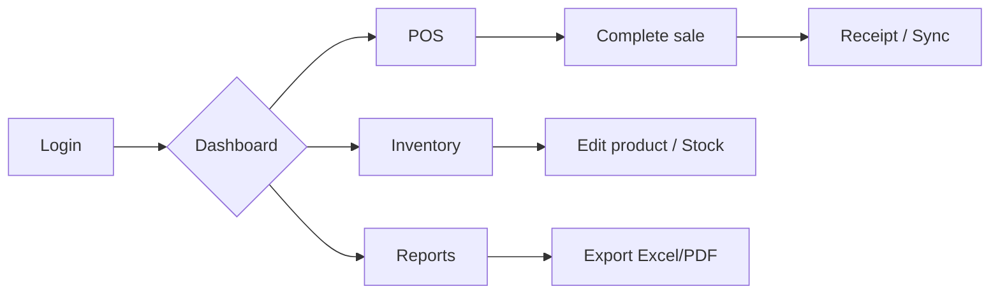

# Egypt Supermarket Management System — UI/UX Wireframes

## Design Principles

- **Arabic-first, RTL:** Primary language Arabic with full RTL layout; English as secondary with LTR.
- **Touch-friendly:** POS and any tablet use: large tap targets (min 44px), clear hierarchy.
- **EGP everywhere:** Currency symbol and formatting (e.g. ١٢٣.٤٥ ج.م or 123.45 EGP) consistent.
- **Accessibility:** Sufficient contrast (WCAG 2.1 AA), focus states, semantic structure for screen readers.
- **Performance:** Lazy load lists; skeleton loaders; optimistic UI for POS.

---

## 1. Application Shell (Dashboard / Admin)

```
+------------------------------------------------------------------+
| [Logo]  ESMS          [Branch ▼]   [AR | EN]   [Notifications]  [User ▼] |
+------------------------------------------------------------------+
|          |                                                         |
|  🏠 Home |  +---------------------------------------------------+  |
|  📦 Inv. |  |  Dashboard (Arabic RTL mirror)                     |  |
|  🛒 Sales|  |  - Today: Revenue, Transactions, Top products     |  |
|  👥 Cust.|  |  - Charts: Sales trend, Category breakdown        |  |
|  🚚 Suppl.|  |  - Alerts: Low stock, Expiry, Pending sync        |  |
|  👤 Emp. |  |  - Quick actions: New sale, New PO, Export        |  |
|  📊 Rep. |  +---------------------------------------------------+  |
|  ⚙️ Set. |                                                         |
+----------+---------------------------------------------------------+
|  © Egypt Supermarket Management System   v1.0                       |
+------------------------------------------------------------------+
```

- **Sidebar:** Collapsible; icons + labels; active state; RTL: sidebar on right.
- **Header:** Branch selector (multi-branch), language toggle (AR/EN), notifications (alerts, sync status), user menu (profile, change password, logout).
- **Main area:** Dashboard or module content; breadcrumbs when deep.

---

## 2. POS Screen (Cashier)

```
+------------------------------------------------------------------+
|  [Branch name]    Receipt # -     [Customer ▼]  [Coupon]  [User]  |
+------------------------------------------------------------------+
|  Cart (touch list)              |  Product entry / Numpad         |
|  ------------------------------|  ------------------------------  |
|  1. Basmati Rice  2 x 45.00    |  [Barcode scan / search box]    |
|     90.00 EGP         [−] [+]  |  [Grid: categories or products]  |
|  2. Oil 1L  1 x 35.00          |  or [0][1][2]...[9] [.] [Clear]  |
|     35.00 EGP         [−] [+]  |  [Quantity] [Add to cart]        |
|  3. ...                        |                                 |
|  ------------------------------|  [Discount %] [Discount EGP]     |
|  Subtotal:        125.00 EGP   |  [Apply coupon]                  |
|  Discount:        -12.50 EGP   |                                 |
|  VAT (14%):        15.75 EGP   |  [CASH] [CARD] [MIXED]          |
|  ------------------------------|  [Complete sale] (primary, big)  |
|  TOTAL:           128.25 EGP   |  [Hold] [Void last] [New sale]  |
+------------------------------------------------------------------+
```

- **Layout:** Two main zones—cart (left in LTR, right in RTL) and product/numpad (right in LTR).
- **Touch:** Large buttons; quantity +/-; discount and coupon clearly visible; single prominent “Complete sale”.
- **Offline:** Indicator (e.g. “Offline – will sync when connected”); disable card payment when offline if needed.

---

## 3. Inventory List

```
+------------------------------------------------------------------+
|  Products (المنتجات)              [Search...] [Filter ▼] [+ Add]  |
+------------------------------------------------------------------+
|  [ ]  SKU      Name (AR/EN)      Category    Stock   Price   Expiry  |
|  ----|--------|-----------------|----------|-------|-------|--------|
|  [ ]  SKU-001  أرز بسمتي          Food       25     45.00   -       |
|  [ ]  SKU-002  زيت طهي            Food       12     35.00   15 days  |
|  [ ]  SKU-003  ...               ...        Low!     ...     ...    |
+------------------------------------------------------------------+
|  [Bulk actions ▼]   Pagination: < 1 2 3 ... 10 >   Show 20 per page |
+------------------------------------------------------------------+
```

- **Table:** Sortable columns; row actions (Edit, Adjust stock, View history); “Low stock” and “Expiry” badges.
- **Filters:** Category, low stock only, expiry range.
- **RTL:** Columns order and alignment mirrored.

---

## 4. Product Edit / Create

```
+------------------------------------------------------------------+
|  Edit product (تعديل المنتج)                    [Save] [Cancel]   |
+------------------------------------------------------------------+
|  Name (Arabic)   [________________]   Name (English) [________________] |
|  SKU             [________________]   Category       [Dropdown ▼]     |
|  Price (EGP)     [________]   Cost (EGP) [________]   VAT % [14]       |
|  Track expiry    [✓]   Alert (days) [7]   Min stock [____]             |
|  Barcodes        [6221043000012] [+ Add]                               |
|  Active          [✓]                                                    |
+------------------------------------------------------------------+
```

- **Form:** Clear labels in both languages or per locale; validation messages inline; EGP and numeric fields formatted.

---

## 5. Sales History / Report

```
+------------------------------------------------------------------+
|  Sales report                    From [date] To [date] [Branch ▼] [Export] |
+------------------------------------------------------------------+
|  Summary cards:  Total revenue | Transactions | Avg basket | Discounts   |
+------------------------------------------------------------------+
|  Table: Receipt# | Date/Time | Cashier | Customer | Total EGP | Status   |
|  [Drill-down to receipt detail on click]                           |
+------------------------------------------------------------------+
|  Chart: Daily revenue (bar/line) for selected period               |
+------------------------------------------------------------------+
```

- **Export:** Excel / PDF as per API; show “Export in progress” and link when ready.

---

## 6. Customer Profile

```
+------------------------------------------------------------------+
|  Customer: Mohamed (محمد)                    [Edit] [Send SMS]     |
+------------------------------------------------------------------+
|  Phone: +20 10 123 4567   Email: customer@example.com             |
|  Loyalty: 250 points (Total earned: 500 | Redeemed: 250)          |
+------------------------------------------------------------------+
|  Recent purchases                                                |
|  Receipt #    Date         Total EGP   [View]                     |
|  B1-2025-042  14 Feb 2025  128.25      [View]                     |
|  ...                                                              |
+------------------------------------------------------------------+
```

- **Loyalty:** Clear balance and history; optional “Redeem” or “Add points” for manager.

---

## 7. Login

```
+------------------------------------------------------------------+
|                         [Logo] ESMS                               |
|                  Egypt Supermarket Management System               |
+------------------------------------------------------------------+
|                  [Email input]                                    |
|                  [Password input]     [Show/Hide]                  |
|                  [Remember me]                                     |
|                  [Login] (primary button)                          |
|                  [Forgot password?]                                |
+------------------------------------------------------------------+
|                  AR | EN  (language toggle)                       |
+------------------------------------------------------------------+
```

- **RTL:** Form and labels flip; logo and branding stay consistent.
- **Security:** No prefill of password; rate limit message after N failures.

---

## 8. Mobile (Owner) — Simplified

- **Dashboard:** Today’s revenue, transaction count, top 3 products; sync status.
- **Alerts:** Low stock, expiry, high void rate (fraud alert).
- **Navigation:** Bottom tab or drawer: Home, Alerts, Branches (if multi).

---

## 9. Wireframe Assets (Mermaid)

For a **flow diagram** of main user journeys:



---

## 10. Component Library Suggestions

- **React:** Use a RTL-aware UI library (e.g. MUI, Chakra, Ant Design) and set `dir="rtl"` and `lang="ar"` on root when Arabic is selected.
- **POS:** Consider a dedicated touch component set or large custom buttons for numpad and actions.
- **Charts:** Recharts, Chart.js, or ApexCharts; ensure RTL flip for axes and legend when needed.
- **Tables:** Virtualized lists for large product/sale lists (e.g. react-window, TanStack Table).

These wireframes define structure and behavior; high-fidelity mockups (Figma/Sketch) can be derived from this for branding and visual design.
